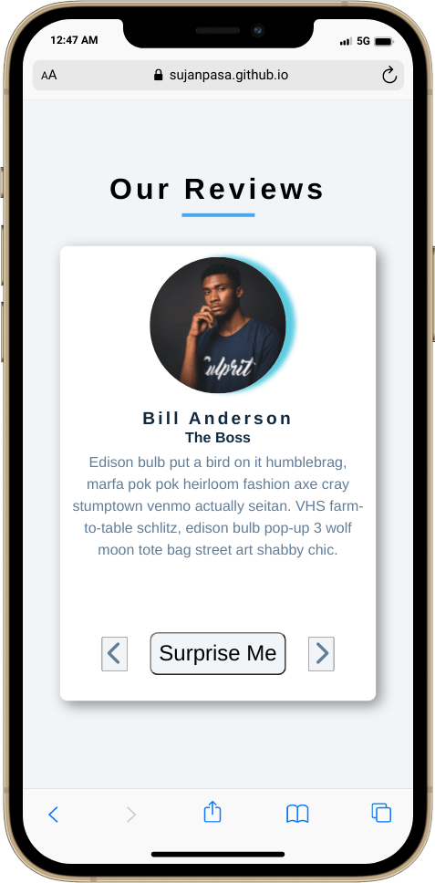

# Interactive Review (JavaScript)

## Technologies Used
- HTML
- CSS
- JavaScript

## How it works
With JavaScript when previous or next button are clicked new reviiew is generated with the use of JavaScript pulling data from an Object wihtin the `app.js` . When `Surprise Me` button is clicked a random review is generated.